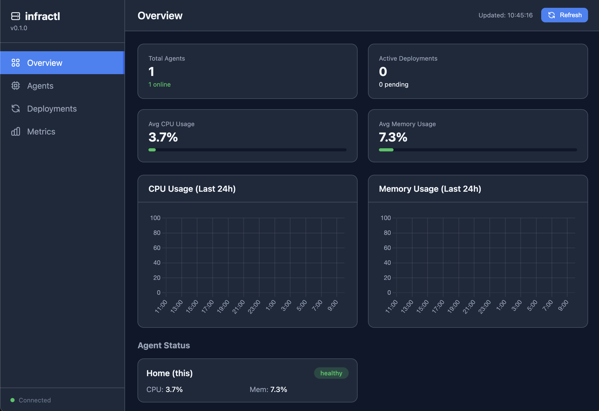

# infractl

Infrastructure monitoring and deployment agent for self-hosted servers.



## Features

- **System Monitoring**: CPU, RAM, disk, network metrics
- **Docker Integration**: Container stats, compose project tracking
- **Auto-Deploy**: Git pull, Docker pull, custom scripts via webhooks
- **Distributed Architecture**: Home (central) + Agent (worker) modes
- **Web Dashboard**: Real-time metrics visualization
- **Auto-Update**: Self-update from GitHub Releases

## Architecture

```
┌─────────────────────────────────────────────────────────────┐
│                         HOME                                │
│  ┌─────────────┐  ┌─────────────┐  ┌─────────────────────┐ │
│  │  Dashboard  │  │   Storage   │  │   Agent Polling     │ │
│  │  :8111/     │  │   SQLite    │  │   /health → agents  │ │
│  └─────────────┘  └─────────────┘  └─────────────────────┘ │
└─────────────────────────────────────────────────────────────┘
                            │
                     Internal Network
                      (10.0.0.0/8)
                            │
        ┌───────────────────┼───────────────────┐
        ▼                   ▼                   ▼
┌──────────────┐    ┌──────────────┐    ┌──────────────┐
│   AGENT 1    │    │   AGENT 2    │    │   AGENT N    │
│   :8111      │    │   :8111      │    │   :8111      │
│  - metrics   │    │  - metrics   │    │  - metrics   │
│  - deploy    │    │  - deploy    │    │  - deploy    │
└──────────────┘    └──────────────┘    └──────────────┘
```

## Quick Start

### Installation

```bash
curl -fsSL https://github.com/razumnyak/infractl/releases/latest/download/install.sh | sudo bash
```

Or with specific version and mode:

```bash
curl -fsSL ... | sudo bash -s -- --version v0.1.5 --mode home
```

### Docker

```bash
docker run -d \
  --name infractl \
  -p 8111:8111 \
  -v /var/run/docker.sock:/var/run/docker.sock:ro \
  -e JWT_SECRET=your-secret-here \
  ghcr.io/razumnyak/infractl:latest
```

### Manual

```bash
# Download binary
wget https://github.com/razumnyak/infractl/releases/latest/download/infractl-x86_64-unknown-linux-musl

# Install
sudo mv infractl-* /usr/local/bin/infractl
sudo chmod +x /usr/local/bin/infractl

# Create config
sudo mkdir -p /etc/infractl
sudo infractl --generate-config > /etc/infractl/config.yaml
# Edit config, set jwt_secret

# Run
infractl --config /etc/infractl/config.yaml
```

## Documentation

- [CONFIG.md](CONFIG.md) - Configuration reference
- [DEPLOY.md](DEPLOY.md) - Deployment guide
- [docs/API.md](docs/API.md) - API specification
- [docs/Architecture.md](docs/Architecture.md) - Technical architecture

## Endpoints

| Endpoint | Mode | Description |
|----------|------|-------------|
| `GET /health` | Both | Health check + metrics |
| `GET /monitoring` | Home | Web dashboard |
| `GET /api/agents` | Home | Agent status |
| `GET /api/metrics` | Home | Metrics history |
| `POST /webhook/deploy/{name}` | Both | Trigger deployment |

## Requirements

- Linux (x86_64 or aarch64)
- Docker (optional, for container metrics)
- Internal network access for Home ↔ Agent communication

## Security

- JWT authentication for API access
- Network isolation (configurable allowed networks)
- Suspicious request logging

## License

MIT
